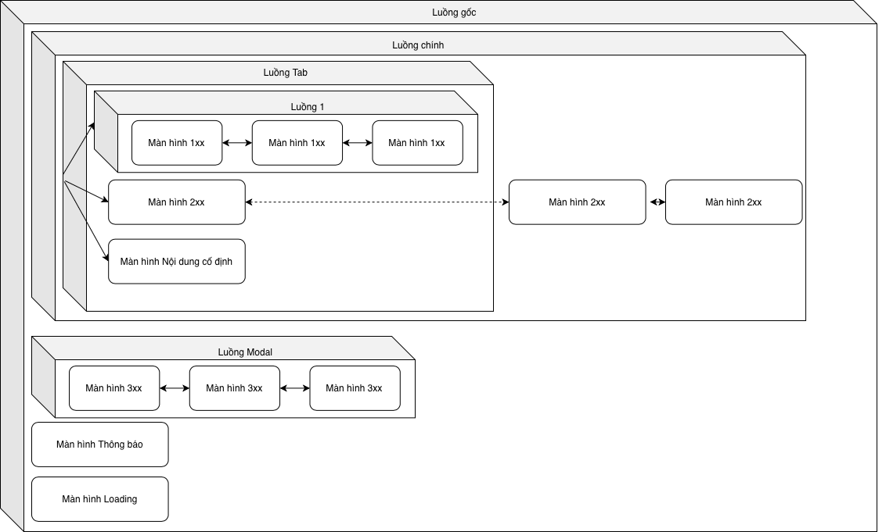

# Màn hình ứng dụng

Xây dựng ứng dụng Flutter theo mô hình thiết kế MVC.

## I. Mô hình MVC:

Đại khái là 1 mô hình thiết kế chi tiết dự án phần mềm. Bao gồm 3 phần:
- **M**odels: khuôn mẫu, có thể hiểu là cấu trúc dữ liệu, là các class, struct biểu diễn dữ liệu đầu vào, đầu ra.
- **V**iew: phần nhìn, có thể hiểu là phần giao diện người dùng (UI).
- **C**ontroller: phần điều khiển, là phần logic của ứng dụng, xử lý dữ liệu đầu và và trả dữ liệu kết quả cho người dùng, kết nối giữa 2 phần **Model** và **View**. Đây là phần xương sống của 1 ứng dụng. Điều khiển có thể bao gồm điều khiển dữ liệu, điều khiển giao diện hoặc bao gồm cả 2.

Gói `Màn hình ứng dụng` này tập trung chủ yếu vào xây dựng phần điều khiển **Controller** và 1 góc phần nhìn **View** cho ứng dụng Flutter trên điện thoại (iOS/Android).

## II. Thiết kế chi tiết dự án:

- Chia ứng dụng thành các màn hình.
- Cấu trúc, hệ thống việc di chuyển giữa các màn hình thành các luồng màn hình.

**Thiết kế của ứng dụng Ví dụ:**



- Ứng dụng có 1 luồng màn hình gốc, chứa các màn hình theo chiều sâu, tức là hiển thị theo dạng stack chồng lên nhau.
- Luồng gốc có luồng màn hình ban đầu gọi là luồng chính, bao gồm các màn hình di chuyển ngang.
- Luồng chính có luồng man hình ban đầu gọi là luồng tab (các trang ngang hàng), chứa 3 tab cố định:
  - Tab 1: là 1 luồng màn hình gọi là luồng 1, chứa các màn hình nội dung di chuyển theo phương ngang.
  - Tab 2: là 1 màn hình nội dung. Từ màn hình này cũng di chuyển sang được các màn hình nội dung khác nhưng là trong luồng chính (tức là di chuyển ngoài luồng tab).
  - Tab 3: 1 màn hình với view cố định.
- Từ bất kỳ màn hình nội dung nào có thể hiển thị màn hình kiểu modal (hiển thị đè lên màn hình hiện tại, có thể là màn hình thông báo, màn hình Loading, hay 1 luồng màn hình Modal mới) bằng cách thêm các màn hình/luồng màn hình vào luồng gốc.

## III. Triển khai:

### III.1. Màn hình:

Với 1 màn hình, tạo điều khiển màn hình (controller):

```
class DieuKhienManHinhNoiDung extends DieuKhienManHinh {

}
```

View của màn hình sử dụng widget của Flutter, có 2 phương án sau:

- PA1: Gán view của màn hình từ ban đầu.
    ```
    DieuKhienManHinhNoiDung dieuKhien = DieuKhienManHinhNoiDung();
    dieuKhien.widgetCuaManHinh = Widget(...);
    ```
    hoặc
    ```
    class DieuKhienManHinhNoiDung extends DieuKhienManHinh {
        DieuKhienManHinhNoiDung() {
            widgetCuaManHinh = Widget(...);
        }
    }
    ```
- PA2: override hàm `xayDungGiaoDienNguoiDung`:
    ```
    class DieuKhienManHinhNoiDung extends DieuKhienManHinh {
        @override
        Widget xayDungGiaoDienNguoiDung(BuildContext context) {
            return Widget(...);
        }
    }
    ```
    Mặc định thì hàm `xayDungGiaoDienNguoiDung` là `return this.widgetCuaManHinh`.

PA1 thường dùng cho các trường hợp không cần subclass `DieuKhienManHinh`, ví dụ như cho các luồng màn hình.

Widget cho view của màn hình có thể là `StatelessWidget`. Nhưng thực tế thì hay dùng `StatefulWidget` vì nội dung màn hình là không cố định. Có thể triển khai `StatefulWidget` cho màn hình theo phương án sau (hoặc hoàn toàn có thể triển khai `StatefulWidget` theo phương án riêng, từ subclass `DieuKhienManHinh` khi cần cập nhật lại giao diện thì gọi các hàm tự thiết kế thay vì sử dụng mẫu sau):
```
class ManHinhNoiDung extends WidgetCuaDieuKhienManHinh<DieuKhienManHinhNoiDung> {

  const ManHinhNoiDung({super.key, required super.dieuKhienManHinh});

  @override
  State<StatefulWidget> createState() => _TrangThaiManHinhNoiDung();

}

class _TrangThaiManHinhNoiDung extends TrangThaiWidgetCuaDieuKhien<ManHinhNoiDung> {

  @override
  void initState() {
    super.initState();
    // Khởi tạo trạng thái hiển thị theo trạng thái của `widget.dieuKhienManHinh`.
  }

  @override
  void capNhaptGiaoDienCuaManHinh({required DieuKhienManHinh dieuKhienManHinh, Map<String, dynamic>? duLieuDinhKem}) {
    // Cập nhật lại hiển thị theo tham số trong `duLieuDinhKem` hoặc/và trạng thái của `widget.dieuKhienManHinh`
  }

  @override
  Widget build(BuildContext context) {
    // Xây dựng widget như bình thường
  }

}
```

- StatefulWidget của màn hình subclass `WidgetCuaDieuKhienManHinh<Class_điều_khiển_màn_hình>`: lớp cơ sở `WidgetCuaDieuKhienManHinh` chứa thuộc tính `dieuKhienManHinh` trỏ tới đối tượng điều khiển màn hình.
- State của StatefulWidget của màn hình subclass `TrangThaiWidgetCuaDieuKhien<Class_widget_của_màn_hình>`: lớp cơ sở thực hiện việc gán đối tượng state hiện tại vào với đối tượng điều khiển màn hình trong các hàm `initState` và `didUpdateWidget`:
    ```
    widget.dieuKhienManHinh.trangThaiWidgetManHinh = this;
    ```
- State của StatefulWidget của màn hình subclass override hàm `capNhaptGiaoDienCuaManHinh`: khi cần cập nhật lại giao diện hiển thị của widget, điều khiển màn hình gọi `trangThaiWidgetManHinh?.capNhaptGiaoDienCuaManHinh(dieuKhienManHinh: this, duLieuDinhKem: {...});`

### III.2. Luồng màn hình:

Luồng màn hình bản chất cũng là 1 màn hình, nhưng thực hiện việc đặc thù: chứa danh sách các màn hình thuộc luồng, quản lý màn hình nào là màn hình hiện tại của luồng.

Vì luồng màn hình cũng là 1 màn hình nên luồng màn hình có thể chứa luồng màn hình con.

Điều khiển luồng màn hình và widget của luồng màn hình cũng có thể triển khai tương tự như điều khiển và widget của màn hình:
```
class LuongManHinhCuaToi extends LuongManHinh {
  @override
  Widget xayDungGiaoDienNguoiDung(BuildContext context) {
    return Widget(...);
  }
}
```

Nhưng thông thường là dùng trực tiếp `LuongManHinh`:
```
final LuongManHinh luongChinh = LuongManHinh();
luongChinh.widgetCuaManHinh = SomeStatefulWidget(...);
```

Việc cần triển khai chủ yếu của luồng màn hình là tạo (hoặc sử dụng class có sẵn) StatefulWidget cho điều khiển luồng màn hình để xử lý việc hiển thị màn hình hiện tại, chuyển qua lại các màn hình.

#### III.2.a. Các widget luồng màn hình dựng sẵn:

- `WidgetLuongManHinhDonGian`: widget luồng màn hình đơn giản nhất, chỉ  hiển thị widget màn hình hiện tại, không có hiệu ứng chuyển màn hình.
- `WidgetLuongManHinhTruot`: widget luồng màn hình chỉ hiển thị widget màn hình hiện tại. Có hiệu ứng chuyển động trượt màn hình khi thay đổi màn hình hiện tại.
  - Các tham số khởi tạo:
    - `doDaiHoatHinh`: Mặc định 300ms. độ dài `Duration` của hiệu ứng chuyển động.
    - `phuongHuong`: Mặc định: trái sang phải. Phương hướng trượt màn hình. Theo 4 phương (khi thêm màn hình vào luồng): trên trượt xuống, dưới trượt lên, trái sang phải và phải sang trái (tương ứng khi loại màn hình khỏi luồng là từ bình thường trượt lên, trượt xuống, sang phải, sang trái - tức là ngược lại lúc thêm vào).
    - `choPhepChamKhiChuyenDongHoatHinh`: mặc định là `false`. Khi đang trong quá trình chuyển động thay đổi màn hình thì tất cả các widget con liên quan đều nằm trong `IgnorePointer` nhằm tránh tương tác với người dùng.
  - Tham số điều khiển:
    - Khi gọi các hàm thêm, loại màn hình của điều khiển luồng màn hình, gắn thêm tham số: `dieuKhienLuong.themManHinh(manHinh: dieuKhienManHinh, thamSo: {WidgetLuongManHinhTruot.kKeyThamSoHoatHoa: false});` để bỏ qua hiệu ứng chuyển động.
- `WidgetLuongManHinhXepLop`: widget luồng màn hình hiển thị widget các màn hình trong `Stack` (tức là xếp chồng lên nhau theo nhiều lớp), có áp dụng hiệu ứng chuyển động.
  - Tham số khởi tạo:
    - `doDaiHoatHinh`: Mặc định 300ms. độ dài `Duration` của hiệu ứng chuyển động.
    - `choPhepChamKhiChuyenDongHoatHinh`: mặc định là `false`. Khi đang trong quá trình chuyển động thay đổi màn hình thì tất cả các widget con liên quan đều nằm trong `IgnorePointer` nhằm tránh tương tác với người dùng.
    - `hoatHinh`: kiểu `WidgetLuongXepLopXayDungLop`, hàm xây dựng widget hoạt hình để áp dụng hiệu ứng chuyển màn hình.
  - Tham số điều khiển:
    - Với 1 màn hình trong luồng, cấu hình `manHinh.thamSoDieuKhienWidgetLuong[WidgetLuongManHinhXepLop.kKeyThamSoLopTrong] = true` để chỉ định màn hình có thể hiển thị đè thành 1 lớp hay không (xem bên dưới). Mặc định là `false`.
    - Cấu hình `manHinh.thamSoDieuKhienWidgetLuong[WidgetLuongManHinhXepLop.kKeyThamSoChoPhepHoatHinh] = true` hoặc `dieuKhienLuong.themManHinh(manHinh: dieuKhienManHinh, thamSo: {WidgetLuongManHinhXepLop.kKeyThamSoChoPhepHoatHinh: false});` để chỉ định có áp dụng hiệu ứng chuyển màn hình hay không.
    - Cấu hình `manHinh.thamSoDieuKhienWidgetLuong[WidgetLuongManHinhXepLop.kKeyThamSoHoatHinh] = ...` hoặc `dieuKhienLuong.themManHinh(manHinh: dieuKhienManHinh, thamSo: {WidgetLuongManHinhXepLop.kKeyThamSoHoatHinh: ...});` với giá trị kiểu `WidgetLuongXepLopXayDungLop` để chỉ định hiệu ứng chuyển màn hình.
  - Xếp lớp: từ màn hình hiện tại trở về các màn hình có thứ tự nhỏ hơn, tiếp tục hiển thị các màn hình cho đến khi gặp màn hình có tham số `kKeyThamSoLopTrong` là `false`.
  - Thứ tự ưu tiên (giảm dần) các giá trị tham số `kKeyThamSoChoPhepHoatHinh` và `kKeyThamSoHoatHinh` (giá trị cuối cùng được sử dụng): `thamSo` trong các hàm thay đổi màn hình của luồng màn hình > `thamSoDieuKhienWidgetLuong` của điều khiển màn hình đích > tham số khởi tạo của chính widget `WidgetLuongManHinhXepLop`.

#### III.2.b. Xây dựng widget cho luồng màn hình:

- Vì luồng màn hình xử lý việc thay đổi màn hình nên widget của nó phải là `StatefulWidget`.
- Tạo 1 class `StatefulWidget` làm widget cho luồng màn hình theo miêu tả tạo widget cho màn hình ở trên.
```
class TrangThaiWidgetLuongManHinhCuaToi extends TrangThaiWidgetCuaDieuKhien<WidgetLuongManHinhCuaToi> {

  bool _daKhoiTao = false;

  @override
  void initState() {
    super.initState();
    _daKhoiTao = false;
  }

  @override
  void didUpdateWidget(covariant WidgetLuongManHinhTruot oldWidget) {
    super.didUpdateWidget(oldWidget);
    _daKhoiTao = false;
  }

  @override
  void capNhaptGiaoDienCuaManHinh({required DieuKhienManHinh dieuKhienManHinh, ThamSoDieuKhienWidgetManHinh? duLieuDinhKem}) {
    dynamic temp = duLieuDinhKem?[LuongManHinh.kKeyThamSoDieuKhienWidgetLuongMH];
    if (temp is! ThamSoDieuKhienWidgetLuongManHinh) {
      throw("WidgetLuongManHinhTruot: Điều khiển màn hình không phải là 1 luồng");
    }
    final ThamSoDieuKhienWidgetLuongManHinh thamSoDk = temp;
    ...
  }

  @override
  Widget build(BuildContext context) {
    if (!_daKhoiTao) {
      _daKhoiTao = true;
      final manHinhCanHienThi = widget.dieuKhienManHinh.manHinhHienTaiCuaLuong?.taoContainer(context);
      return manHinhCanHienThi;
    }
    return ...; // Xây dựng màn hình
  }

}
```
- Vì trong hàm `initState` chưa có context, ta có thể đặt 1 cờ `_daKhoiTao` để trong hàm `build` xây dựng giao diện cho trường hợp ban đầu (không có hiệu ứng chuyển màn hình, hiển thị trạng thái hiện tại của luồng màn hình luôn).
- Trong hàm `capNhaptGiaoDienCuaManHinh`, lấy tham số điều khiển của luồng màn hình từ key `kKeyThamSoDieuKhienWidgetLuongMH`, là 1 object kiểu `ThamSoDieuKhienWidgetLuongManHinh`. Các thuộc tính:
  - `thamSoDieuKhienThayDoiManHinh`: chính là `thamSo` trong các hàm thay đổi màn hình của luồng màn hình.
  - `manHinhMoi`: mục màn hình cần được hiển thị. Có thể `null` (không có màn hình nào được hiển thị nữa). Mục này thì chắc chắn nằm trong `danhSachManHinh`.
  - `manHinhCu`: mục màn hình hiển thị trước đó. Có thể `null`. Mục này có thể nằm trong `danhSachManHinh` (ví dụ di chuyển màn hình từ màn hình thứ tự lớn về màn hình thứ tự nhỏ), hoặc có thể không (màn hình bị loại ra khỏi luồng).
  - `danhSachManHinh`: danh sách tất cả các màn hình hiện tại của luồng (sau khi thay đổi).
  - `hoatTatThayDoi`: hàm này bắt buộc phải gọi sau khi hoàn tất di chuyển widget màn hình. Giới hạn 1s (sau 1s mà hàm này không được gọi thì sẽ báo exception).

### III.3. Kết hợp màn hình và luồng màn hình:

- Trong `main.dart`, tạo 1 luồng màn hình làm luồng gốc cho toàn bộ app ở widget gốc của app:
```
class MyApp extends StatelessWidget {

  final LuongManHinhCuaToi luongMHGoc = LuongManHinh();

  MyApp({super.key}) {
    // Gán widget cho luồng gốc, thêm các màn hình/luồng màn hình ban đầu vào cho luồng màn hình gốc
    luongMHGoc.widgetCuaManHinh = WidgetLuongManHinh...
  }

  // This widget is the root of your application.
  @override
  Widget build(BuildContext context) {
    return MaterialApp(
      ...
      home: Container(
        child: luongMHGoc.xayDungGiaoDienNguoiDung(context)
      )
    );
  }
}
```
- Thêm màn hình vào trong luồng: `luongManHinh.themManHinh(manHinh: manHinh, ...);`.
- Loại màn hình khỏi luồng: `luongManHinh.loaiManHinh(manHinh: manHinh, ...);`.
- Gán lại toàn bộ danh sách màn hình: `luongManHinh.ganDanhSachManHinh(...);`.
- Đăt lại màn hình hiện tại: `luongManHinh.ganManHinhHienTai(stt: ...);`.

> Tham số các hàm xem chú thích trong source code của hàm đó.

- Các thuộc tính của `DieuKhienManHinh`:
  - `luongManHinh`: kiểu `LuongManHinh`, luồng màn hình đang chứa màn hình hiện tại. Lưu ý chỉ sử dụng `get` của thuộc tính này, còn `set` thì do luồng màn hình gán.
  - `trangThaiWidgetManHinh`: `State` hiện tại của StatefulWidget của điều khiển màn hình. Gán trong các hàm `initState` và `didUpdateWidget` của class State của Widget của màn hình. Trong điều khiển màn hình, có thể sử dụng thuộc tính này để cập nhật lại giao diện hiển thị.
  - `thamSoDieuKhienWidgetLuong`: các tham số để truyền cho widget của luồng màn hình chứa màn hình hiện tại.
- Các sự kiện của `DieuKhienManHinh`:
  - `manHinhDuocThemVaoLuong`
  - `luongManHinhDuocThemVaoLuong(LuongManHinh luong)`
  - `manHinhBiLoaiBoKhoiLuong()`
  - `luongManHinhBiLoaiKhoiLuong(LuongManHinh luong)`
  - `manHinhSeThanhManHinhChinhTrongLuong()`
  - `luongManHinhSeThanhManHinhChinhTrongLuong(LuongManHinh luong)`
  - `manHinhDaThanhManHinhChinhTrongLuong()`
  - `luongManHinhDaThanhManHinhChinhTrongLuong(LuongManHinh luong)`
  - `manHinhSeThoiLamManHinhChinhTrongLuong()`
  - `luongManHinhSeThoiLamManHinhChinhTrongLuong(LuongManHinh luong)`
  - `manHinhDaThoiLamManHinhChinhTrongLuong()`
  - `luongManHinhDaThoiLamManHinhChinhTrongLuong(LuongManHinh luong)`
> Chi tiết xem chú thích trong source code.
- Quản lý vòng đời của `DieuKhienManHinh`:
  - 1 object `DieuKhienManHinh` chỉ nên thêm vào trong 1 luồng. Nhiều luồng cùng chứa 1 object `DieuKhienManHinh` có thể chạy sai logic.
  - 1 object `DieuKhienManHinh` có thể trải qua các giai đoạn sau: khởi tại (constructor) -> thêm vào luồng (`manHinhDuocThemVaoLuong`) -> được làm màn hình chính trong luồng (`manHinhSeThanhManHinhChinhTrongLuong` -[hiệu ứng chuyển màn]-> `manHinhDaThanhManHinhChinhTrongLuong`) -> thôi làm màn hình chính trong luồng (`manHinhSeThoiLamManHinhChinhTrongLuong` -[hiệu ứng chuyển màn]-> `manHinhDaThoiLamManHinhChinhTrongLuong`) -> loại khỏi luồng (`manHinhBiLoaiBoKhoiLuong`).
  - Trong hàm `manHinhBiLoaiBoKhoiLuong` thì xử lý tương tự như hàm `dispose` của Flutter: loại bỏ các kết nối (listener, observer ...). Object `DieuKhienManHinh` sau thời điểm của hàm này thì không sử dụng nữa.
  - Mặc định hàm `manHinhBiLoaiBoKhoiLuong` của `DieuKhienManHinh` xoá bỏ kết nối đến `trangThaiWidgetManHinh`. Hàm `manHinhBiLoaiBoKhoiLuong` của `LuongManHinh` đồng thời cũng sẽ loại bỏ các màn hình con của nó (để đảm bảo các màn hình con cũng nhận được sự kiện `manHinhBiLoaiBoKhoiLuong`). Các hàm như `manHinhDuocThemVaoLuong`, ... của `LuongManHinh` sẽ gọi tiếp vào các hàm tương ứng `luongManHinhDuocThemVaoLuong`, ... của các màn con.
  - Vì vậy khi subclass `DieuKhienManHinh` và `LuongManHinh` cần chú ý gọi `super...` nếu override các hàm sự kiện ở trên.
## Giấy phép:

MIT (xem [License](./LICENSE))
